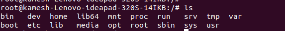
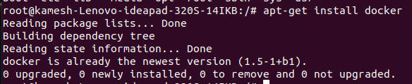

# MyJail

Steps to create a simple jail on ubuntu /debian systems.
Once created can be copied/modified on to other systems and run

```
mkdir d
debootstrap stretch d
mount -B /dev d/dev
mount -B /dev/pts d/dev/pts
mount -B /proc d/proc
mount -B /sys d/sys
chroot d /bin/bash
```

Note: might have to use sudo if restricted

once the chroot to the jail (the folder 'd' that was created) you would be in a fully functioning debian setup




Now you may install your packages of choosing
`apt update`

you may want to update your package manager, probably `yum upgrade -y` in redhat

`apt-get install docker`



you can run docker within the confines of folder 'd' or even postgre
`apt-get install postgresql`

Note: you may have to jump through some hoops to get the services started as it is within chroot and requests might be ignored
https://superuser.com/questions/688733/start-a-systemd-service-inside-chroot

